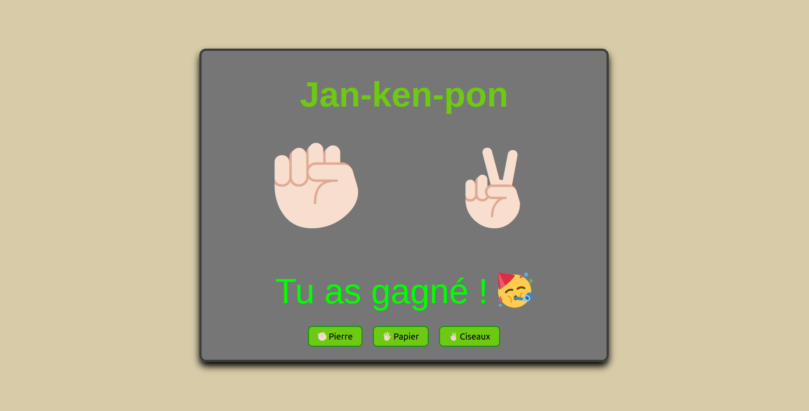

# Pierre-Papier-Ciseaux

Un simple jeu de Pierre-Papier-Ciseaux en utilisant HTML, CSS et JavaScript, avec des représentations Unicode des choix de pierre, papier et ciseaux.

## Instructions

1. Clonez ce dépôt ou téléchargez les fichiers.
    
    SSH
    ```bash
    git clone git@github.com:Shinzoku/Jan-ken-pon.git
    ```
    
    HTML
    ```bash
    git clone https://github.com/Shinzoku/pierre-papier-ciseaux.git
    ```

2. Ouvrez le fichier `index.html` dans votre navigateur pour jouer au jeu.

## Structure

```plaintext
carrousel/
│
├── index.html       # Le fichier HTML contenant la structure de base du jeu.
├── style.css        # Le fichier CSS pour le style de la page.
├── script.js        # Le fichier JavaScript contenant la logique du jeu.
├── LICENCE.txt      # Fichier TXT pour le type de license utilisé.
├── README.md        # Documentation du projet
```

## Utilisation

Lorsque vous ouvrez le fichier `index.html`, vous verrez trois boutons représentant Pierre, Papier et Ciseaux avec des emojis. Cliquez sur l'un des boutons pour faire votre choix. L'ordinateur fera un choix aléatoire, et le résultat du jeu sera affiché en dessous des boutons.

## Exemple de jeu

- Si vous choisissez ✊🏻 (Pierre) et l'ordinateur choisit ✌🏻 (Ciseaux), vous gagnez.
- Si vous choisissez 🖐🏻 (Papier) et l'ordinateur choisit ✊🏻 (Pierre), vous gagnez.
- Si vous choisissez ✌🏻 (Ciseaux) et l'ordinateur choisit 🖐🏻 (Papier), vous gagnez.
- Si vous et l'ordinateur faites le même choix, c'est une égalité.

## Technologies utilisées

- HTML
- CSS
- JavaScript

## Aperçu



## Auteur

- **Nicolas Bernon**

## Licence

Ce projet est sous licence MIT - voir le fichier [LICENSE](https://choosealicense.com/licenses/mit/) pour plus de détails.
